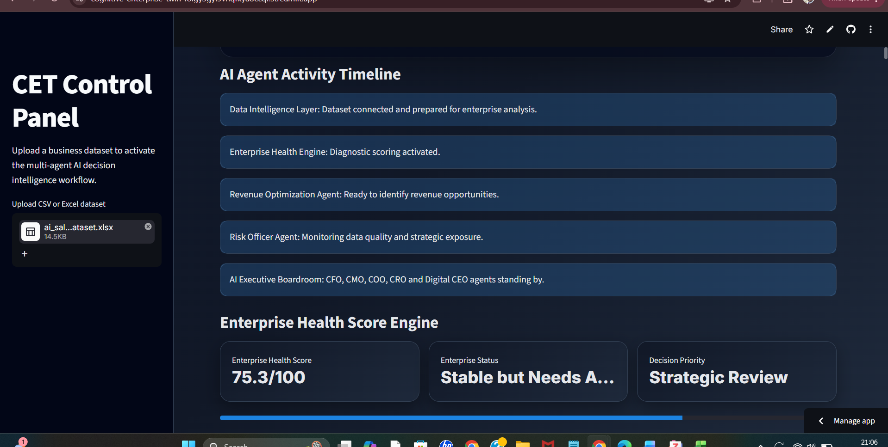
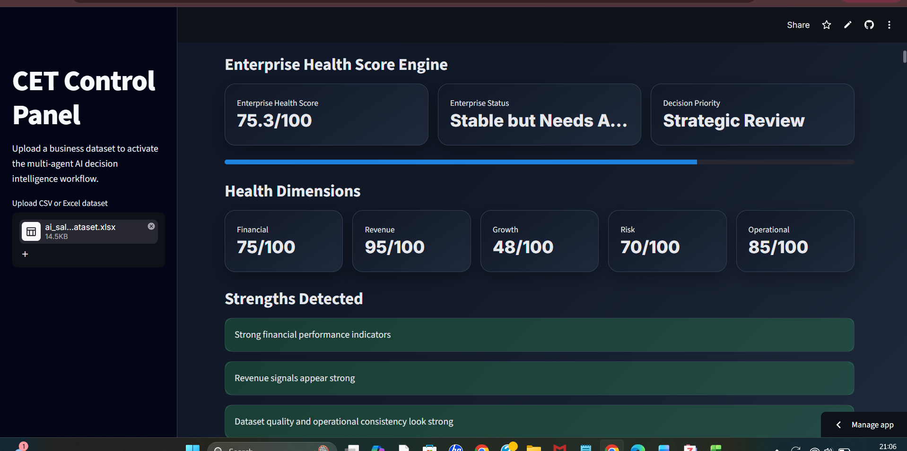
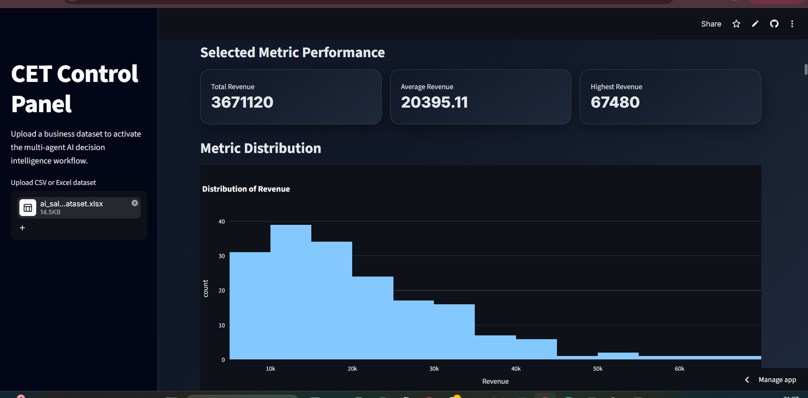
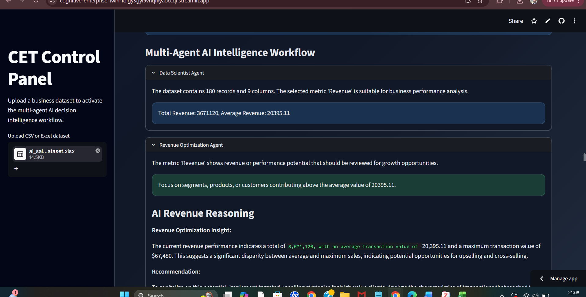

# 🧠 Cognitive Enterprise Twin

## Executive Intelligence Operating System for SMEs

> **Cognitive Enterprise Twin (CET)** is a multi-agent AI platform that
> transforms enterprise data into executive-level decision intelligence.
> It combines enterprise health assessment, forecasting, scenario
> simulation, AI boardroom reasoning, organizational memory, competitor
> intelligence, and strategic recommendations within a unified Executive
> Operating System.

------------------------------------------------------------------------

# 🌐 Live Demo

https://cognitive-enterprise-twin-foigy3gyl9vnqfkyaoccqf.streamlit.app

# 📂 GitHub Repository

https://github.com/kamranafridi9220-prog/cognitive-enterprise-twin

------------------------------------------------------------------------

# ✨ What's New (Latest Update)

## Executive UI & UX Redesign

The platform now features a significantly enhanced executive interface
inspired by modern enterprise AI platforms.

### New additions

-   Executive Hero Banner
-   AI Executive Operating System branding
-   CET Control Panel
-   Enterprise Mission Control Dashboard
-   Enterprise Data Summary
-   Executive Signal Feed
-   AI Agent Activity Timeline
-   Premium KPI Cards
-   Modern executive layout
-   Improved navigation experience
-   Enhanced visual hierarchy

------------------------------------------------------------------------

# 🚀 Core Platform Capabilities

-   Multi-Agent Decision Intelligence
-   Enterprise Health Score Engine
-   Revenue Optimization Agent
-   Risk Officer Agent
-   Strategy Agent
-   CEO Decision Agent
-   Chief Knowledge Officer
-   Enterprise Memory Engine
-   Opportunity Discovery Engine
-   Forecasting Engine
-   Strategic Shock Simulator
-   AI Executive Voting System
-   Enterprise Time Machine
-   AI Competitor Twin
-   AI Executive Boardroom
-   Boardroom Consensus Engine
-   Strategic Growth Navigator
-   AI Investment Advisor
-   Autonomous Executive Meeting Generator

------------------------------------------------------------------------

# 📸 Updated Application Screenshots

## Home Dashboard

## Dataset Preview & Enterprise Summary

## Enterprise Mission Control

## AI Agent Activity Timeline

## Enterprise Health Score Engine

## Enterprise Performance Analytics

## Multi-Agent Intelligence Workflow

------------------------------------------------------------------------

# 🛠 Technology Stack

-   Python
-   Streamlit
-   Pandas
-   NumPy
-   Plotly
-   OpenPyXL
-   Multi-Agent AI
-   Executive Decision Intelligence
-   Git & GitHub

------------------------------------------------------------------------

# 🔮 Roadmap

## UI Evolution

-   Enterprise navigation workspace
-   Executive command centre
-   AI notification centre
-   Interactive executive dashboards
-   Advanced enterprise visualisations

## AI Evolution

-   Dynamic KPI discovery
-   Autonomous board meetings
-   Agent collaboration graph
-   Executive chat workspace
-   Enterprise Digital Twin Score
-   Live agent orchestration

------------------------------------------------------------------------

# 👨‍💻 Author

**Kamran Khan**

GitHub: https://github.com/kamranafridi9220-prog

If you find this project interesting, consider starring the repository.
