# 🧠 Cognitive Enterprise Twin

## A Multi-Agent Decision Intelligence Platform for SMEs

The **Cognitive Enterprise Twin (CET)** is an advanced AI-powered decision intelligence platform designed to help Small and Medium-Sized Enterprises (SMEs) transform business data into strategic insights, forecasts, opportunities, organizational learning, and executive-level recommendations.

Unlike traditional Business Intelligence dashboards that primarily focus on descriptive analytics, the Cognitive Enterprise Twin combines multiple specialized AI agents, enterprise memory, forecasting capabilities, strategic debate mechanisms, and organizational learning to support more informed and explainable business decision-making.

The platform represents an initial step toward the development of a digital cognitive layer capable of continuously analysing, learning, reasoning, and supporting strategic business decisions.

---

# 🌐 Live Demo

### 🚀 Try the Application

https://cognitive-enterprise-twin-foigy3gyl9vnqfkyaoccqf.streamlit.app

---

# 📂 GitHub Repository

https://github.com/kamranafridi9220-prog/cognitive-enterprise-twin

---

# 🎯 Project Vision

The long-term vision of the Cognitive Enterprise Twin is to create an intelligent digital representation of an organization capable of:

* Understanding business performance
* Identifying risks and opportunities
* Learning from historical decisions
* Forecasting future outcomes
* Simulating strategic scenarios
* Supporting executive decision-making

The platform aims to provide SMEs with capabilities traditionally available only to large enterprises with dedicated strategy, analytics, and consulting teams.

---

# 🚀 Why This Project Was Built

Many organizations collect large volumes of business data but struggle to convert that information into actionable strategic intelligence.

Traditional dashboards often answer:

* What happened?
* How much was sold?
* Which region performed best?

However, executives typically require answers to more complex questions:

* What opportunities exist?
* What risks should be monitored?
* What may happen in the future?
* What strategic action should be taken?

The Cognitive Enterprise Twin was developed to bridge this gap by introducing multi-agent reasoning and decision intelligence capabilities into the business analytics workflow.

---

# 🏗️ System Architecture

The Cognitive Enterprise Twin consists of multiple interconnected intelligence layers:

```text
Business Dataset
        ↓
Data Processing Layer
        ↓
Multi-Agent Intelligence Layer
        ↓
Strategic Debate Layer
        ↓
Decision Intelligence Engine
        ↓
Enterprise Memory Layer
        ↓
Organizational Learning Layer
        ↓
Executive Recommendation Layer
```

---

# 🤖 Multi-Agent Intelligence Framework

The platform currently includes multiple specialized AI agents.

---

## 📊 Data Scientist Agent

Responsibilities:

* Dataset analysis
* Data quality assessment
* Business metric evaluation
* Analytical evidence generation

Outputs:

* Dataset insights
* Business metric evaluation
* Supporting evidence

---

## 📈 Revenue Optimization Agent

Responsibilities:

* Revenue analysis
* Performance assessment
* Growth opportunity identification

Outputs:

* Revenue insights
* Growth recommendations
* Strategic priorities

---

## ⚠️ Risk Officer Agent

Responsibilities:

* Risk detection
* Data quality assessment
* Performance risk evaluation

Outputs:

* Risk assessment
* Risk classification
* Operational warnings

---

## 🎯 Strategy Agent

Responsibilities:

* Strategic interpretation
* Opportunity balancing
* Growth prioritization

Outputs:

* Strategic guidance
* Priority recommendations

---

## 👔 CEO Decision Agent

Responsibilities:

* Executive review
* Final recommendation generation
* Strategic decision support

Outputs:

* Executive summary
* Strategic recommendation

---

## 🧠 Chief Knowledge Officer Agent

Responsibilities:

* Enterprise learning
* Historical review
* Organizational memory analysis

Outputs:

* Knowledge insights
* Historical trend evaluation
* Learning recommendations

---

# 🏢 Enterprise Memory Engine

One of the most innovative components of the platform is the Enterprise Memory Engine.

Unlike traditional dashboards that forget previous analyses, the Cognitive Enterprise Twin stores historical decision intelligence records.

The memory layer captures:

* Dataset analysed
* Selected business metric
* Decision score
* Strategic classification
* Revenue perspective
* Risk perspective
* Executive recommendations

This creates a foundation for organizational learning and future knowledge accumulation.

---

# 🔍 Opportunity Discovery Engine

The Opportunity Discovery Engine proactively searches for business opportunities within uploaded datasets.

Current capabilities include:

### High-Performance Opportunities

Identifies:

* High-performing records
* Exceptional business outcomes
* Growth patterns

### Improvement Opportunities

Identifies:

* Underperforming records
* Operational weaknesses
* Revenue improvement areas

### Performance Variation Opportunities

Identifies:

* High variability patterns
* Potential segmentation opportunities
* Areas requiring deeper investigation

---

# 📈 Forecasting Agent

The Forecasting Agent provides predictive insights regarding future business performance.

Current outputs include:

* Current performance baseline
* 3-Month forecast
* 6-Month forecast
* 12-Month forecast

The forecasting component introduces predictive analytics capabilities into the decision-making process.

---

# ⚖️ Strategic Debate Engine

A unique feature of the Cognitive Enterprise Twin is its strategic debate mechanism.

Rather than generating a single recommendation immediately, multiple agents contribute competing viewpoints.

Example:

Revenue Perspective:

* Growth opportunities

Risk Perspective:

* Potential threats

Strategy Perspective:

* Balanced recommendation

These perspectives are synthesized before the final executive recommendation is produced.

---

# 🎯 Decision Intelligence Engine

The Decision Intelligence Engine converts agent outputs into structured strategic recommendations.

Capabilities include:

### Decision Scoring

Generates:

```text
0 – 40   High Risk
41 – 60  Moderate Risk
61 – 80  Strategic Opportunity
81 – 100 Strong Strategic Opportunity
```

### Decision Classification

Provides explainable decision categories that executives can understand and communicate.

---

# 📊 Key Platform Features

### Dataset Upload

Supports:

* CSV
* XLSX

### Dataset Preview

Provides:

* Data inspection
* Business record review

### KPI Analytics

Automatically calculates:

* Total values
* Average values
* Maximum values

### Data Visualization

Includes:

* Histograms
* Forecast charts
* Metric distributions

### Multi-Agent Analysis

Coordinates:

* Analytical reasoning
* Strategic reasoning
* Executive reasoning

### Organizational Learning

Creates historical intelligence through enterprise memory.

---

# 🖥️ User Workflow

```text
Upload Dataset
       ↓
Review Data Summary
       ↓
Select Business Metric
       ↓
Generate KPI Analysis
       ↓
Discover Opportunities
       ↓
Generate Forecasts
       ↓
Execute Multi-Agent Analysis
       ↓
Conduct Strategic Debate
       ↓
Store Enterprise Memory
       ↓
Generate Organizational Learning
       ↓
Receive Executive Recommendation
```

---

# 📸 Application Screenshots

# 📸 Application Screenshots

## Dashboard Overview

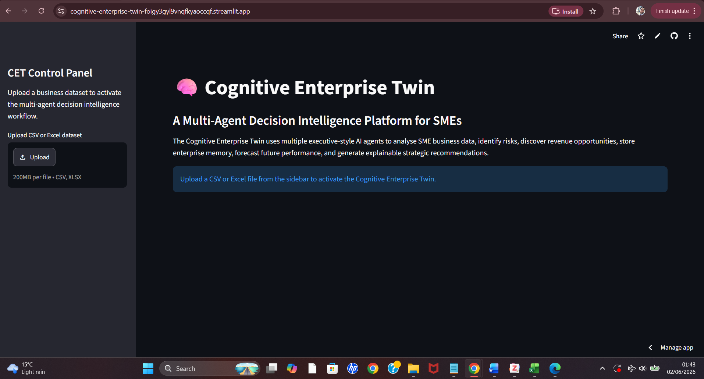

The main landing page of the Cognitive Enterprise Twin where users can upload datasets and activate the multi-agent decision intelligence workflow.

---

## Dataset Preview

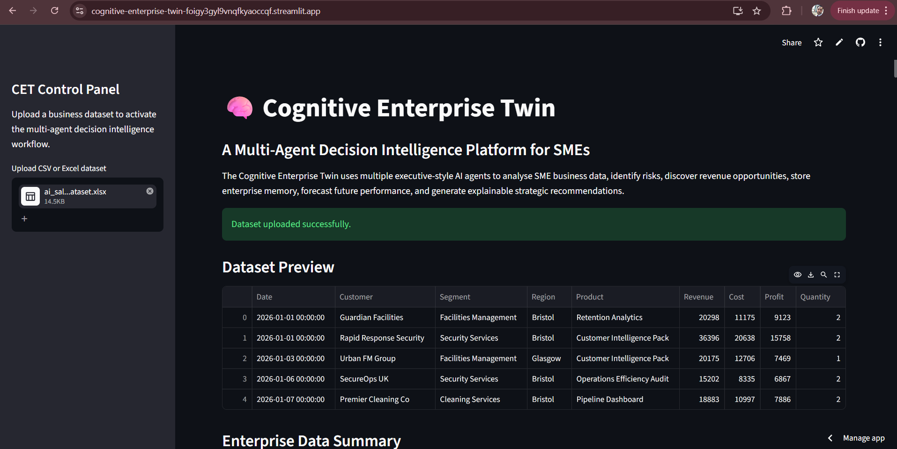

Business data preview before analysis begins.

---

## Enterprise Data Summary

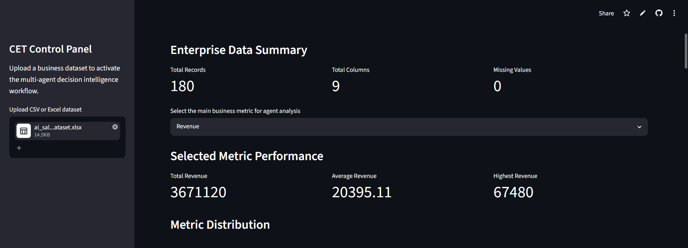

High-level dataset statistics including records, columns, and data quality indicators.

---

## Strategic Decision Score

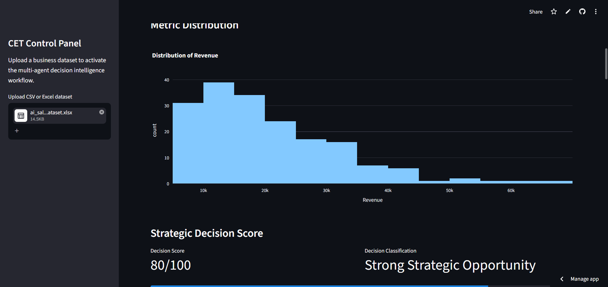

Decision Intelligence Engine output showing strategic score and classification.

---

## Opportunity Discovery Engine

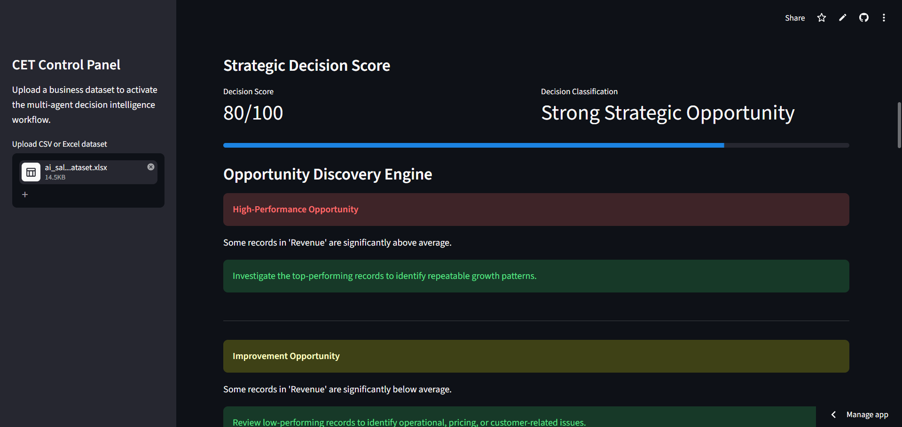

Automatically identifies business growth opportunities and improvement areas.

---

## Forecasting Agent

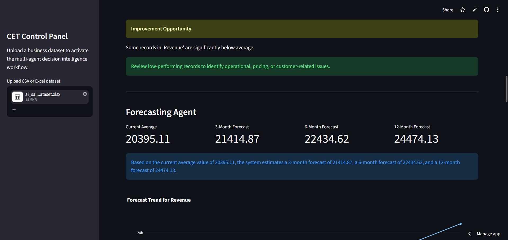

Future business performance projections.

---

## Forecast Trend Analysis

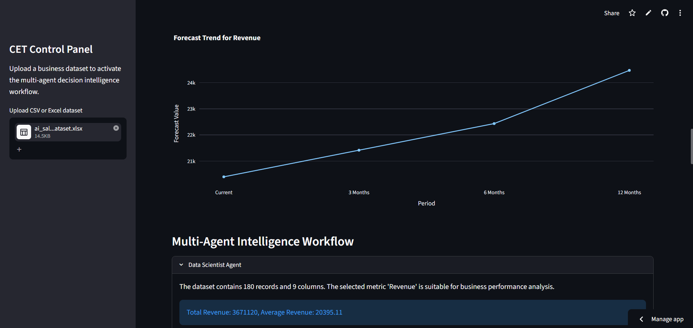

Visualization of forecasted business trends.

---

## Multi-Agent Intelligence Workflow

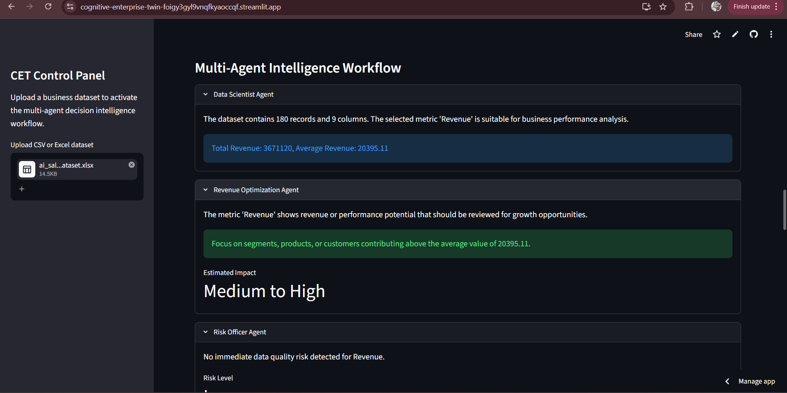

Collaborative analysis generated by specialized AI agents.

---

## Executive Agent Analysis

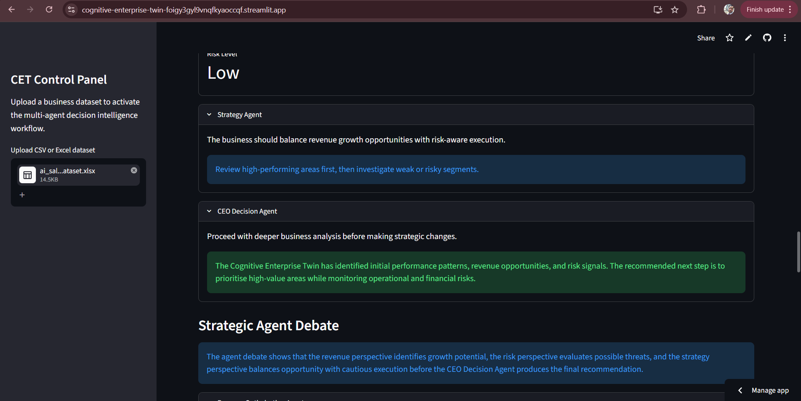

Strategy Agent and CEO Decision Agent recommendations.

---

## Strategic Agent Debate

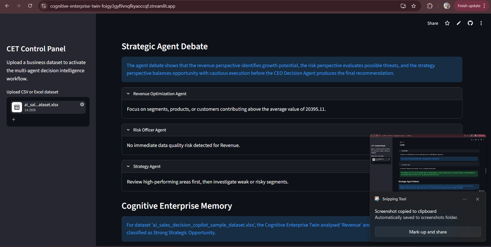

Multi-perspective reasoning between revenue, risk, and strategy agents.

---

## Enterprise Memory Layer

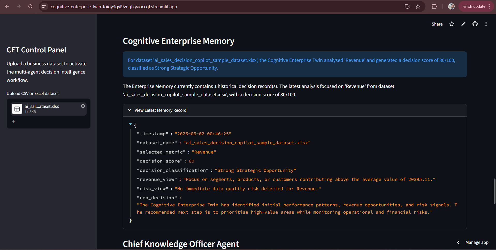

Historical decision records and organizational intelligence storage.

---

## Chief Knowledge Officer Agent

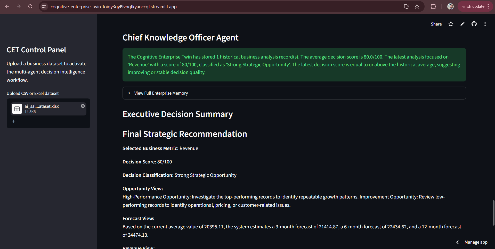

Organizational learning and historical decision analysis.

---

## Executive Decision Summary

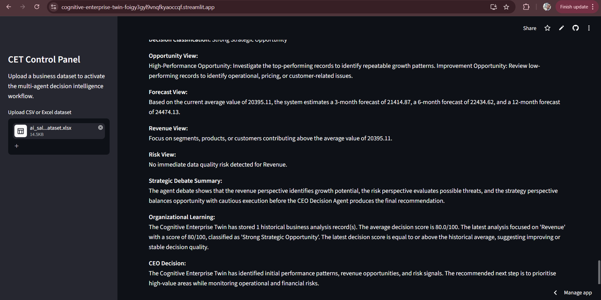

Final executive recommendation generated by the Cognitive Enterprise Twin.

---

# 🛠️ Technology Stack

### Programming Language

* Python

### Framework

* Streamlit

### Data Processing

* Pandas
* NumPy

### Visualization

* Plotly

### Data Import

* OpenPyXL

### Deployment

* Streamlit Community Cloud

### Version Control

* Git
* GitHub

---

# 📁 Repository Structure

```text
cognitive-enterprise-twin/
│
├── app.py
├── agents.py
├── forecasting_agent.py
├── opportunity_engine.py
├── decision_engine.py
├── memory_engine.py
├── requirements.txt
│
├── ARCHITECTURE.md
├── PRODUCT_VISION.md
├── ROADMAP.md
│
└── README.md
```

---

# 🔮 Future Development Roadmap

Planned enhancements include:

### Scenario Simulation Engine

Evaluate:

* Revenue growth scenarios
* Cost reduction scenarios
* Strategic alternatives

---

### Automatic KPI Discovery

Automatically identify:

* Revenue
* Cost
* Profit
* Margin
* Customer metrics

---

### Advanced Forecasting

Introduce:

* Time-series forecasting
* Trend analysis
* Predictive modeling

---

### Executive Boardroom Intelligence

Create a collaborative executive decision environment where specialized agents debate and vote on strategic decisions.

---

### Cognitive Enterprise Twin Evolution

Long-term goal:

A continuously learning digital strategic advisor capable of supporting organizational planning, risk management, and growth optimization.

---

# 🎓 Potential Applications

The platform may be useful for:

* SMEs
* Business managers
* Strategy teams
* Sales leaders
* Operations managers
* Business analysts
* Researchers
* Decision-support practitioners

---

# 📜 License

This project is provided for educational, research, and innovation purposes.

---

# 👨‍💻 Author

Kamran Khan

GitHub:
https://github.com/kamranafridi9220-prog

Project:
Cognitive Enterprise Twin – A Multi-Agent Decision Intelligence Platform for SMEs
