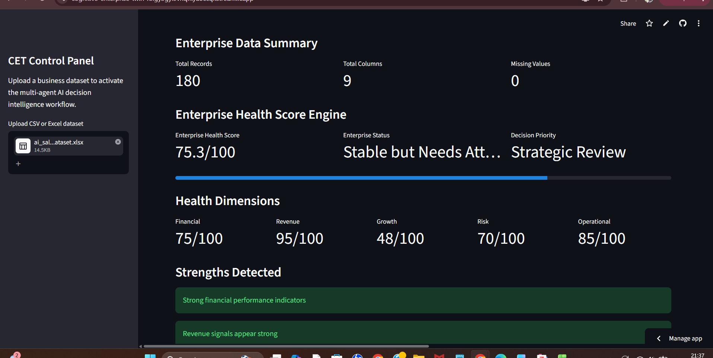
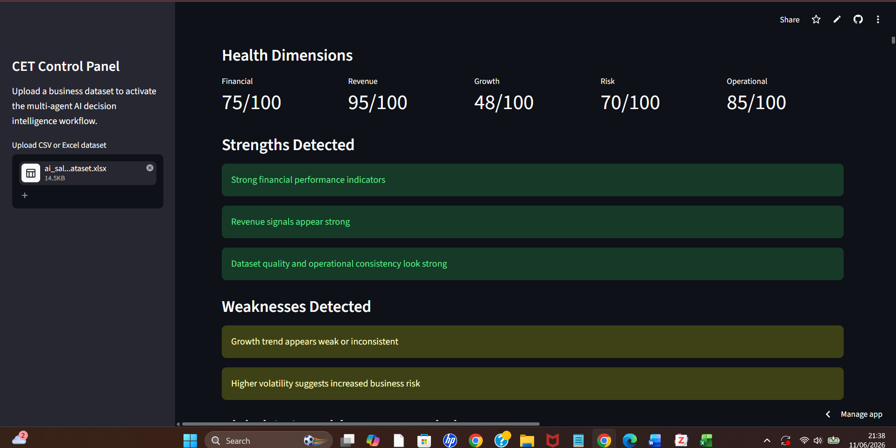
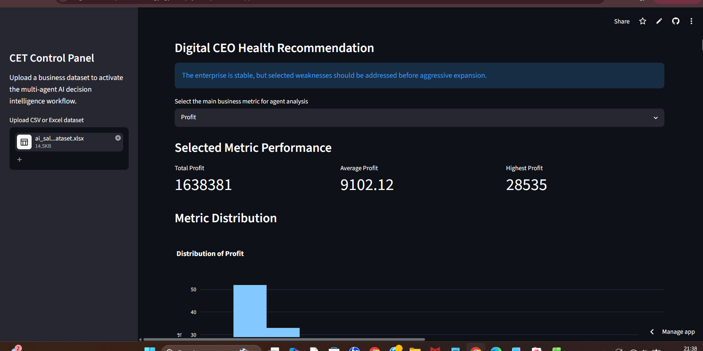
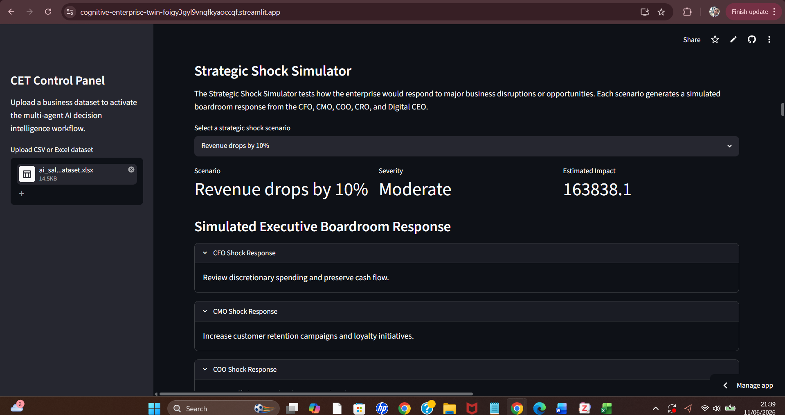
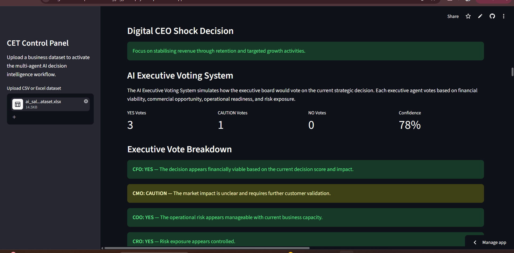
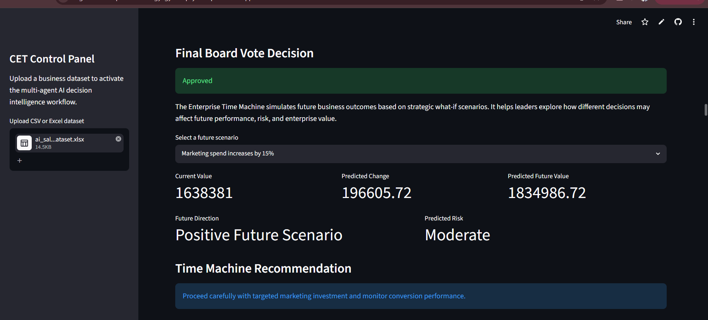
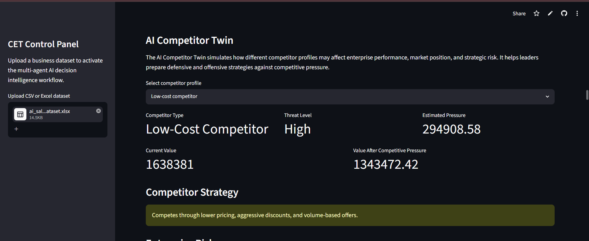
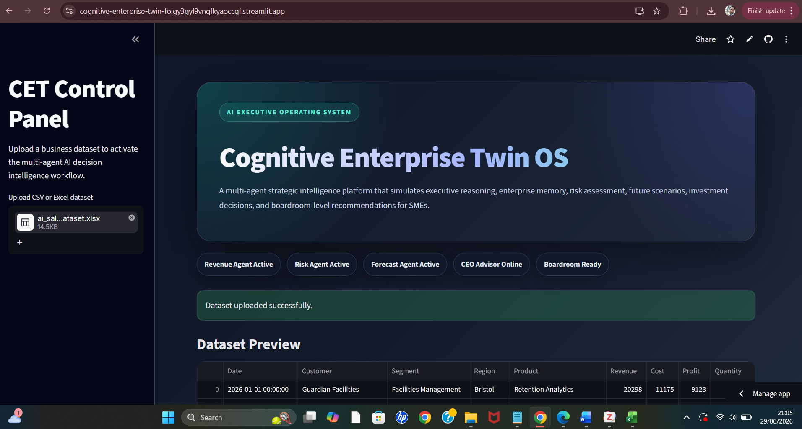
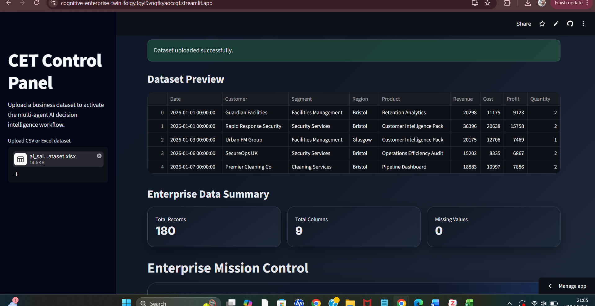
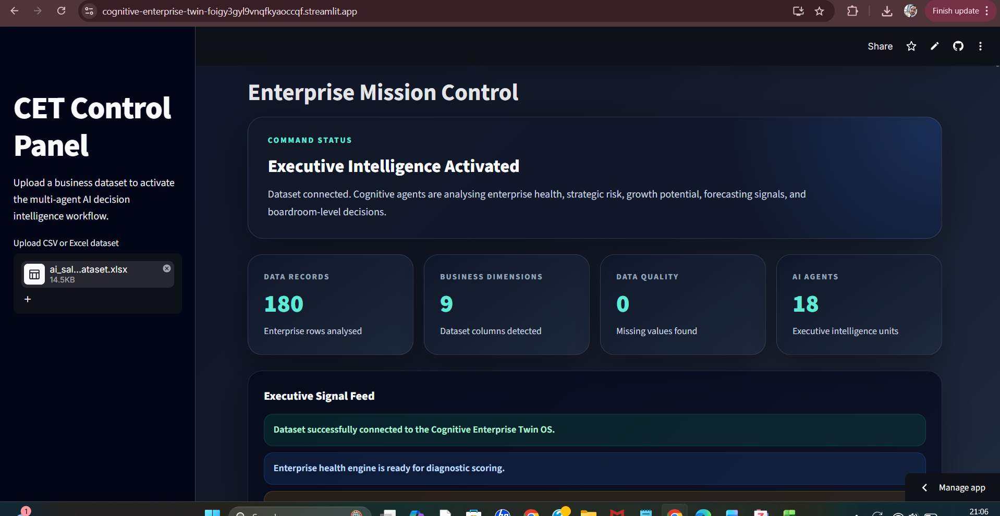

# 🧠 Cognitive Enterprise Twin

## A Multi-Agent Decision Intelligence Platform for SMEs

The **Cognitive Enterprise Twin (CET)** is an advanced AI-powered decision intelligence platform designed to help Small and Medium-Sized Enterprises (SMEs) transform business data into strategic insights, forecasts, opportunities, organizational learning, competitive intelligence, scenario simulations, and executive-level recommendations.

Unlike traditional Business Intelligence dashboards that primarily focus on descriptive analytics, the Cognitive Enterprise Twin combines multiple specialized AI agents, enterprise memory, forecasting capabilities, executive boardroom simulations, strategic debate mechanisms, future scenario modelling, competitive intelligence, and organizational learning to support more informed and explainable business decision-making.

The platform represents an initial step toward the development of a digital cognitive layer capable of continuously analysing, learning, reasoning, simulating, and supporting strategic business decisions.

---

# 🌐 Live Demo

### 🚀 Try the Application

https://cognitive-enterprise-twin-foigy3gyl9vnqfkyaoccqf.streamlit.app

---

# 📂 GitHub Repository

https://github.com/kamranafridi9220-prog/cognitive-enterprise-twin

---

# 🎯 Project Vision

The long-term vision of the Cognitive Enterprise Twin is to create an intelligent digital representation of an organization capable of:

* Understanding business performance
* Identifying risks and opportunities
* Learning from historical decisions
* Forecasting future outcomes
* Simulating strategic scenarios
* Modelling competitive threats
* Supporting executive decision-making
* Providing explainable AI recommendations

The platform aims to provide SMEs with capabilities traditionally available only to large enterprises with dedicated strategy, analytics, consulting, and business intelligence teams.

---

# 🚀 Why This Project Was Built

Many organizations collect large volumes of business data but struggle to convert that information into actionable strategic intelligence.

Traditional dashboards often answer:

* What happened?
* How much was sold?
* Which region performed best?

However, executives typically require answers to more complex questions:

* What opportunities exist?
* What risks should be monitored?
* What may happen in the future?
* What would happen under different business scenarios?
* How should we respond to competitors?
* What strategic action should be taken?

The Cognitive Enterprise Twin was developed to bridge this gap by introducing multi-agent reasoning, scenario simulation, competitive intelligence, organizational learning, and decision intelligence capabilities into the business analytics workflow.

---

# 🏗️ System Architecture

The Cognitive Enterprise Twin consists of multiple interconnected intelligence layers:

```text
Business Dataset
        ↓
Data Processing Layer
        ↓
Enterprise Health Score Engine
        ↓
Multi-Agent Intelligence Layer
        ↓
Strategic Debate Layer
        ↓
Decision Intelligence Engine
        ↓
AI Executive Boardroom
        ↓
Executive Voting System
        ↓
Strategic Shock Simulator
        ↓
Enterprise Time Machine
        ↓
AI Competitor Twin
        ↓
Enterprise Memory Layer
        ↓
Organizational Learning Layer
        ↓
Executive Recommendation Layer
```

---

# 🤖 Multi-Agent Intelligence Framework

The platform currently includes multiple specialized AI agents.

---

## 📊 Data Scientist Agent

Responsibilities:

* Dataset analysis
* Data quality assessment
* Business metric evaluation
* Analytical evidence generation

Outputs:

* Dataset insights
* Business metric evaluation
* Supporting evidence

---

## 📈 Revenue Optimization Agent

Responsibilities:

* Revenue analysis
* Performance assessment
* Growth opportunity identification

Outputs:

* Revenue insights
* Growth recommendations
* Strategic priorities

---

## ⚠️ Risk Officer Agent

Responsibilities:

* Risk detection
* Data quality assessment
* Performance risk evaluation

Outputs:

* Risk assessment
* Risk classification
* Operational warnings

---

## 🎯 Strategy Agent

Responsibilities:

* Strategic interpretation
* Opportunity balancing
* Growth prioritization

Outputs:

* Strategic guidance
* Priority recommendations

---

## 👔 CEO Decision Agent

Responsibilities:

* Executive review
* Final recommendation generation
* Strategic decision support

Outputs:

* Executive summary
* Strategic recommendation

---

## 🧠 Chief Knowledge Officer Agent

Responsibilities:

* Enterprise learning
* Historical review
* Organizational memory analysis

Outputs:

* Knowledge insights
* Historical trend evaluation
* Learning recommendations

---

# 🏥 Enterprise Health Score Engine

The Enterprise Health Score Engine provides a comprehensive assessment of organizational performance across multiple business dimensions.

The engine evaluates:

* Financial Health
* Revenue Health
* Growth Health
* Risk Health
* Operational Health

Outputs include:

* Enterprise Health Score
* Enterprise Status Classification
* Strengths Detection
* Weakness Detection
* Strategic Health Assessment
* Digital CEO Recommendation

The Enterprise Health Score acts as an executive-level indicator of organizational condition before strategic decisions are made.

---

# 🏢 Enterprise Memory Engine

One of the most innovative components of the platform is the Enterprise Memory Engine.

Unlike traditional dashboards that forget previous analyses, the Cognitive Enterprise Twin stores historical decision intelligence records.

The memory layer captures:

* Dataset analysed
* Selected business metric
* Decision score
* Strategic classification
* Revenue perspective
* Risk perspective
* Executive recommendations

This creates a foundation for organizational learning and future knowledge accumulation.

---

# 🏛️ AI Executive Boardroom

A major enhancement to the Cognitive Enterprise Twin is the introduction of the AI Executive Boardroom.

Rather than relying on a single AI recommendation, the platform simulates a virtual executive leadership team where multiple executive agents independently evaluate business performance before contributing to a board-level strategic recommendation.

The Executive Boardroom introduces organizational perspectives commonly found within enterprise leadership structures.

---

## 💰 Chief Financial Officer (CFO)

Responsibilities:

* Revenue quality assessment
* Financial performance review
* Profitability evaluation
* Cost optimization recommendations

Outputs:

* Financial insights
* Revenue sustainability observations
* Financial risk considerations

---

## 📣 Chief Marketing Officer (CMO)

Responsibilities:

* Market opportunity assessment
* Customer growth evaluation
* Positioning recommendations
* Revenue expansion opportunities

Outputs:

* Market intelligence
* Customer acquisition recommendations
* Growth strategy suggestions

---

## ⚙️ Chief Operations Officer (COO)

Responsibilities:

* Operational performance evaluation
* Process optimization recommendations
* Resource allocation analysis
* Delivery capability assessment

Outputs:

* Operational insights
* Efficiency recommendations
* Execution priorities

---

## 🛡️ Chief Risk Officer (CRO)

Responsibilities:

* Strategic risk evaluation
* Business continuity considerations
* Operational vulnerability assessment
* Risk mitigation recommendations

Outputs:

* Risk analysis
* Threat identification
* Mitigation strategies

---

# 🤝 Boardroom Consensus Engine

Following executive evaluation, the Cognitive Enterprise Twin generates a Boardroom Consensus Recommendation.

The Boardroom Consensus Engine combines insights from:

* Chief Financial Officer
* Chief Marketing Officer
* Chief Operations Officer
* Chief Risk Officer

Capabilities include:

* Executive recommendation consolidation
* Strategic prioritization
* Risk balancing
* Opportunity ranking
* Executive-level action planning

This creates a more realistic decision-support environment that mirrors collaborative executive decision-making processes commonly found within modern organizations.

---

# 🌪️ Strategic Shock Simulator

The Strategic Shock Simulator allows leaders to test how the organization may respond to disruptive business events.

Available simulations include:

* Revenue decline scenarios
* Cost increase scenarios
* Competitive threats
* Supply chain disruptions
* Demand surges

The simulator generates responses from:

* CFO
* CMO
* COO
* CRO
* Digital CEO

This creates a realistic executive planning environment capable of supporting scenario-based decision-making.

---

# 🗳️ AI Executive Voting System

The AI Executive Voting System introduces board-level voting mechanisms into the decision intelligence workflow.

Executive participants include:

* Chief Financial Officer
* Chief Marketing Officer
* Chief Operations Officer
* Chief Risk Officer

Outputs include:

* YES votes
* CAUTION votes
* NO votes
* Voting confidence score
* Final board decision

This feature simulates collaborative executive governance processes commonly used in enterprise environments.

---

# ⏳ Enterprise Time Machine

The Enterprise Time Machine simulates future organizational outcomes through strategic what-if analysis.

Example scenarios include:

* Increased marketing investment
* Improved customer retention
* Operational efficiency improvements
* Pricing changes
* Conversion rate improvements
* Market demand reduction

Outputs include:

* Predicted future value
* Predicted change
* Future risk assessment
* Strategic recommendations

The module extends the platform from descriptive analytics into predictive and prescriptive decision intelligence.

---

# 🏆 AI Competitor Twin

The AI Competitor Twin simulates external competitive pressure and strategic market threats.

Supported competitor profiles include:

* Low-cost competitors
* Premium competitors
* Technology-driven competitors
* New market entrants
* Dominant market leaders

Outputs include:

* Threat level assessment
* Competitive pressure estimation
* Market risk analysis
* Recommended strategic response

The Competitor Twin enables organizations to evaluate defensive and offensive strategic options before competitive events occur.

---

# 📊 Key Platform Features

### Dataset Upload

Supports:

* CSV
* XLSX

### Enterprise Health Scoring

Provides:

* Financial health analysis
* Revenue health analysis
* Growth assessment
* Risk assessment
* Operational health assessment

### Forecasting

Provides:

* 3-month forecasts
* 6-month forecasts
* 12-month forecasts

### Strategic Shock Simulation

Simulates major business disruptions and opportunities.

### Executive Voting

Simulates board-level strategic approval processes.

### Enterprise Time Machine

Explores future strategic outcomes through what-if analysis.

### AI Competitor Twin

Evaluates competitor pressure and strategic market threats.

### Organizational Learning

Creates historical intelligence through enterprise memory.

### AI Executive Boardroom

Simulates executive leadership analysis through CFO, CMO, COO, and CRO agents.

### Boardroom Consensus Generation

Produces a consolidated strategic recommendation from multiple executive viewpoints.

### Executive-Level Reasoning

Generates detailed boardroom-style recommendations rather than simple analytical outputs.

# 📸 Application Screenshots

## Dashboard Overview


The main landing page of the Cognitive Enterprise Twin where users can upload datasets and activate the multi-agent decision intelligence workflow.

---

## Dataset Preview


Business data preview before analysis begins.

---

## Enterprise Data Summary


High-level dataset statistics including records, columns, and data quality indicators.

---

## Enterprise Health Score Engine



Comprehensive enterprise-wide health assessment across financial, growth, risk, revenue, and operational dimensions.

---

## Enterprise Health Diagnostics



Automated identification of organizational strengths, weaknesses, and strategic improvement opportunities.

---

## Digital CEO Health Recommendation



Executive-level strategic recommendation generated from the Enterprise Health Score Engine.

---

## Strategic Decision Score


Decision Intelligence Engine output showing strategic score and classification.

---

## Opportunity Discovery Engine


Automatically identifies business growth opportunities and performance improvement areas.

---

## Forecasting Agent


Future business performance projections generated by the forecasting engine.

---

## Forecast Trend Analysis


Visualization of forecasted business performance trends.

---

## Strategic Shock Simulator



Simulation of disruptive business events with executive-level response generation.

---

## AI Executive Voting System



Board-level voting simulation showing approval decisions, confidence scores, and executive reasoning.

---

## Enterprise Time Machine



Future scenario simulation and predictive decision intelligence capabilities.

---

## AI Competitor Twin



Competitive threat simulation with strategic response recommendations and market pressure analysis.

---

## Multi-Agent Intelligence Workflow


Collaborative analysis generated by specialized AI agents.

---

## Executive Agent Analysis


Strategy Agent and CEO Decision Agent recommendations.

---

## Strategic Agent Debate


Multi-perspective reasoning between revenue, risk, and strategy agents.

---

## Enterprise Memory Layer


Historical decision records and organizational intelligence storage.

---

## Chief Knowledge Officer Agent


Organizational learning and historical decision analysis.

---

## Executive Decision Summary


Final executive recommendation generated by the Cognitive Enterprise Twin.

---
---

# 🆕 Executive Operating System (Version 2.0)

The latest milestone transforms the Cognitive Enterprise Twin into a significantly more advanced **Executive Operating System (Executive OS)** designed for enterprise-level decision intelligence.

This release introduces a modern executive interface, premium dashboard experience, enterprise monitoring capabilities, enhanced visual analytics, and an improved multi-agent workflow. The objective is to make the platform resemble a commercial executive intelligence solution rather than a traditional analytics dashboard.

---

# 🚀 What's New

The latest release introduces several major enhancements across user experience, enterprise monitoring, executive dashboards, and AI collaboration.

### Executive Experience

- AI Executive Operating System interface
- Premium landing dashboard
- CET Control Panel
- Modern executive UI
- Improved visual hierarchy
- Enterprise-inspired user experience

### Enterprise Intelligence

- Enterprise Mission Control Dashboard
- Enterprise Data Summary
- Executive Signal Feed
- AI Agent Activity Timeline
- Enhanced Enterprise Health Score Engine

### Executive Analytics

- Premium KPI cards
- Interactive executive dashboards
- Improved enterprise analytics
- Executive performance monitoring
- Professional dashboard layout

---

# 📸 Executive Operating System Showcase

The screenshots below demonstrate the latest evolution of the Cognitive Enterprise Twin platform.

---

## 🏠 Cognitive Enterprise Twin Executive OS

The application now opens with a redesigned Executive Operating System homepage featuring the CET Control Panel, AI Executive Operating System branding, executive status indicators, and a premium enterprise dashboard.



---

## 📊 Enterprise Data Summary

Business datasets are automatically analysed to produce an executive overview including dataset preview, total records, business dimensions, and enterprise data quality indicators.



---

## 🎯 Enterprise Mission Control Dashboard

The Enterprise Mission Control Dashboard provides executives with a real-time operational overview of enterprise intelligence, executive status, AI activity, business dimensions, and executive signal feeds.



---

## 🤖 AI Agent Activity Timeline

The AI Agent Activity Timeline visualises the complete reasoning workflow followed by specialised enterprise AI agents before strategic recommendations are produced.

Current workflow includes:

- Data Intelligence Layer
- Enterprise Health Engine
- Revenue Optimisation Agent
- Risk Officer Agent
- AI Executive Boardroom


---

## 💙 Enterprise Health Score Engine

The redesigned Enterprise Health Score Engine provides executives with an overall organisational health assessment based on Financial Health, Revenue Performance, Growth, Risk, and Operational Readiness.

The dashboard highlights enterprise strengths, decision priorities, and strategic recommendations.


---

## 📈 Executive Performance Analytics

Interactive enterprise analytics provide executive insight into KPI performance, descriptive statistics, and business metric distributions, supporting evidence-based strategic decision making.


---

## 🧠 Multi-Agent AI Intelligence Workflow

The Cognitive Enterprise Twin coordinates multiple specialised AI agents that independently analyse enterprise data before collaboratively generating executive-level recommendations.

Current AI ecosystem includes:

- Data Scientist Agent
- Revenue Optimisation Agent
- Risk Officer Agent
- Strategy Agent
- CEO Decision Agent
- Chief Knowledge Officer Agent
- AI Executive Boardroom
- Boardroom Consensus Engine
- Digital CEO Advisor

The workflow demonstrates how multiple AI specialists collaborate to transform raw enterprise data into strategic business intelligence.


---

# 🌟 Platform Evolution

This release represents one of the largest milestones in the Cognitive Enterprise Twin project.

Key achievements include:

- Complete Executive Operating System redesign
- Enterprise-grade dashboard experience
- Modern executive interface
- Premium visual analytics
- AI Agent Activity Timeline
- Enterprise Mission Control
- Executive Signal Feed
- Enhanced Enterprise Health diagnostics
- Improved enterprise KPI presentation
- More professional user experience inspired by commercial enterprise AI platforms

The Cognitive Enterprise Twin continues to evolve towards a comprehensive enterprise decision intelligence platform capable of supporting executive reasoning, strategic planning, organisational learning, forecasting, scenario simulation, and explainable AI-driven business recommendations.

---
---

# 🛠️ Technology Stack

## Programming Language

* Python

## Framework

* Streamlit

## Data Processing

* Pandas
* NumPy

## Data Visualization

* Plotly

## Data Import

* OpenPyXL

## AI Components

* Multi-Agent Decision Framework
* Executive Boardroom Simulation
* Strategic Debate Engine
* Enterprise Memory Engine
* Executive Voting Engine
* Competitor Intelligence Engine
* Scenario Simulation Engine

## Deployment

* Streamlit Community Cloud

## Version Control

* Git
* GitHub

---

# 📁 Repository Structure

```text
cognitive-enterprise-twin/
│
├── app.py
├── agents.py
├── forecasting_agent.py
├── opportunity_engine.py
├── decision_engine.py
├── memory_engine.py
├── health_score_engine.py
├── shock_simulator.py
├── executive_voting_engine.py
├── enterprise_time_machine.py
├── competitor_twin.py
├── boardroom_agents.py
├── llm_engine.py
├── requirements.txt
│
├── ARCHITECTURE.md
├── PRODUCT_VISION.md
├── ROADMAP.md
│
├── screenshots/
│
└── README.md
```

---

# 🔮 Future Development Roadmap

The Cognitive Enterprise Twin is being developed as a long-term enterprise decision intelligence platform.

Planned enhancements include:

## Autonomous Board Meetings

Enable executive agents to automatically debate and generate consensus recommendations without manual intervention.

---

## Enterprise Strategy Copilot

Provide real-time strategic guidance through conversational AI interactions.

---

## Dynamic KPI Discovery

Automatically identify:

* Revenue metrics
* Cost metrics
* Profit metrics
* Margin metrics
* Customer metrics

without requiring manual selection.

---

## Advanced Forecasting

Introduce:

* Time-series forecasting
* Trend modelling
* Scenario forecasting
* Predictive analytics

---

## Enterprise Digital Twin Expansion

Future versions aim to simulate:

* Organizational behaviour
* Competitive ecosystems
* Market dynamics
* Strategic planning environments

creating a continuously learning enterprise intelligence platform.

---

# 🎓 Potential Applications

The platform may be useful for:

* SMEs
* Business managers
* Strategy teams
* Executive leadership teams
* Sales leaders
* Operations managers
* Business analysts
* Data analysts
* Researchers
* Decision-support practitioners
* AI strategy consultants

---

# 🚀 Research Contribution

The Cognitive Enterprise Twin demonstrates how multiple AI agents can be combined into a unified decision intelligence architecture capable of supporting strategic business decisions.

The project explores concepts including:

* Multi-Agent Systems
* Decision Intelligence
* Business Analytics
* Executive Decision Support
* Enterprise Memory
* Organizational Learning
* Competitive Intelligence
* Scenario Simulation
* Digital Twins
* Explainable AI

The platform aligns closely with emerging research in AI-driven strategic decision support systems and enterprise intelligence architectures.

---

# 📜 License

This project is provided for educational, research, and innovation purposes.

---

# 👨‍💻 Author

**Kamran Khan**

GitHub:
https://github.com/kamranafridi9220-prog

Project:
**Cognitive Enterprise Twin – A Multi-Agent Decision Intelligence Platform for SMEs**

---

### ⭐ If you found this project interesting, consider starring the repository and following future development updates.
